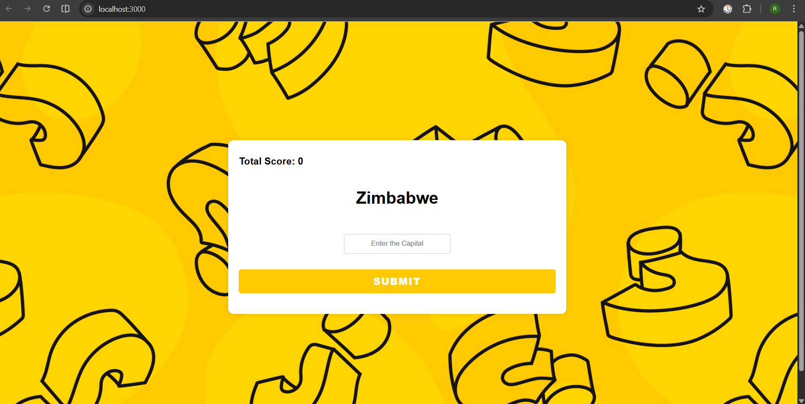
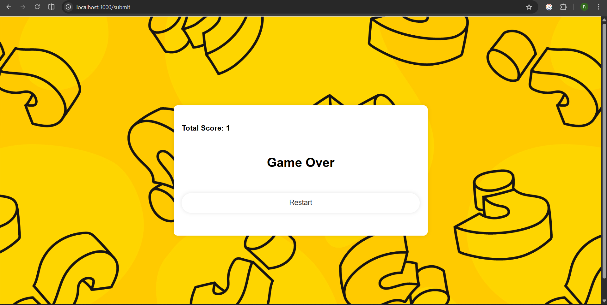

# 🌍 Countries & Capital Quiz

An interactive web-based quiz application that tests users on **countries and their capitals**.  
The game presents a random country, tracks the user’s score in real time, and ends when an incorrect answer is submitted.

---

## 🚀 Features

- 🎯 Random country-based quiz questions
- 🧠 Real-time score tracking
- ❌ Game-over logic on incorrect answers
- 🔁 Restart game functionality
- 🎨 Clean and responsive UI
- 📊 Question data loaded dynamically
- ⚡ Fast server-side rendering using EJS

---

## 🛠️ Tech Stack

### Frontend
- HTML
- CSS
- EJS (Embedded JavaScript Templates)

### Backend
- Node.js
- Express.js

### Database / Data Source
- PostgreSQL (via `pg`)
- CSV-based data loading support

### Other Tools
- dotenv
- body-parser

---

## 📸 Screenshots

### Quiz Interface


### Correct Answer Flow


### Game Over Screen


---

## ⚙️ Installation & Setup

### 1️⃣ Clone the Repository
```bash
git clone https://github.com/ranjit-ux/Countries-Capital-Quiz.git
cd Countries-Capital-Quiz
npm install
npm start
http://localhost:3000

```


``` bash
Countries-Capital-Quiz/
│
├── public/
│   ├── images/
│   └── stylesheets/
│       └── style.css
│
├── views/
│   └── index.ejs
│
├── screenshots/
│   ├── quiz.png
│   ├── correct.png
│   └── game-over.png
│
├── capitals.csv
├── index.js
├── package.json
├── package-lock.json
├── .gitignore
└── README.md
